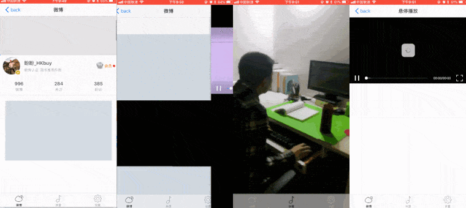
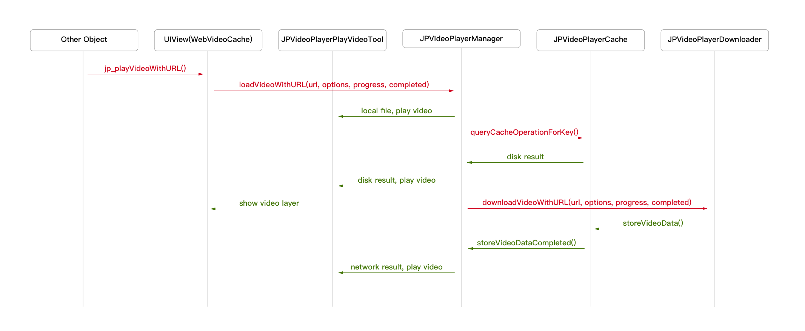

<p align="left" >

</p>

[](https://github.com/newyjp/JPVideoPlayer)
[](https://github.com/newyjp/JPVideoPlayer)
[](http://www.jianshu.com/users/e2f2d779c022/latest_articles)
[](https://github.com/apple/swift)

This library provides an video player with cache support in `UITableView` base on `AVPlayer`.

<p align="left" >

</p>

## Features
- [x] Cache video data at playing.
- [x] Seek time support(new).
- [x] Breakpoint continuingly support(new).
- [x] Landscape auto-layout support(new).
- [x] Custom player controlView support(new).
- [x] Excellent performance!
- [x] A guarantee that the same URL won't be downloaded several times
- [x] A guarantee that main thread will never be blocked
- [x] Location video play support
- [x] Swift support

## Requirements
- iOS 8.0 or later
- Xcode 7.3 or later

## Getting Started
- Read [[iOS]JPVideoPlayer 3.0 使用介绍](https://www.jianshu.com/p/282e3e0cfe78)
- Read [[iOS]JPVideoPlayer 3.0 源码解析](https://www.jianshu.com/p/5de1965824d4)
- Read [[iOS]仿微博视频边下边播之封装播放器](http://www.jianshu.com/p/0d4588a7540f)
- Read [[iOS]仿微博视频边下边播之滑动TableView自动播放](http://www.jianshu.com/p/3946317760a6)
- Read [[iOS]从使用 KVO 监听 readonly 属性说起](http://www.jianshu.com/p/abd238407e0d)
- Read [[iOS]如何重新架构 JPVideoPlayer ?](http://www.jianshu.com/p/66638bdfd537)
- Try the example by downloading the project from Github

## How To Use
### 01.Play video.
#### 1.1.Mute play video and display progressView on `UITableViewCell` or any view.
```objective-c

NSURL *url = [NSURL URLWithString:@"http://p11s9kqxf.bkt.clouddn.com/bianche.mp4"];
[aview jp_playVideoMuteWithURL:url
            bufferingIndicator:nil
                  progressView:nil
           	 configuration:nil];
```


#### 1.2.Resume mute play from `UITableViewController` to  a detail `UIViewController`when user selected a `UITableViewCell`.
```objective-c

NSURL *url = [NSURL URLWithString:@"http://p11s9kqxf.bkt.clouddn.com/bianche.mp4"];
[aview jp_resumeMutePlayWithURL:url
             bufferingIndicator:nil
                   progressView:nil
        	  configuration:nil];
```

#### 1.3.Play video and display controlView & progressView.
```objective-c

NSURL *url = [NSURL URLWithString:@"http://p11s9kqxf.bkt.clouddn.com/bianche.mp4"];
[aview jp_playVideoWithURL:url
        bufferingIndicator:nil
               controlView:nil
              progressView:nil
   	     configuration:nil];
```

#### 1.4.Resume play with displaying controlView & progressView.
```objective-c

NSURL *url = [NSURL URLWithString:@"http://p11s9kqxf.bkt.clouddn.com/bianche.mp4"];
[aview jp_resumePlayWithURL:url
         bufferingIndicator:nil
                controlView:nil
               progressView:nil
    	      configuration:nil];
```

#### 1.5.Play video without controlView & progressView.
```objective-c

NSURL *url = [NSURL URLWithString:@"http://p11s9kqxf.bkt.clouddn.com/bianche.mp4"];
[aview jp_playVideoWithURL:url
		   options:kNilOptions
   	     configuration:nil];
```

#### 1.6. Resume play without controlView & progressView.
```objective-c

NSURL *url = [NSURL URLWithString:@"http://p11s9kqxf.bkt.clouddn.com/bianche.mp4"];
[aview jp_resumePlayWithURL:url
		    options:kNilOptions
    	      configuration:nil];
```


### 2.Landscape Or Portrait Control
#### 2.1. Go to landscape.
```objective-c

[aview jp_gotoLandscape];

[aview jp_gotoLandscapeAnimated:YES completion:nil];
```

#### 2.2. Go to portrait.
```objective-c

[aview jp_gotoPortrait];

[aview jp_gotoPortraitAnimated:YES completion:nil];
```

### 3. Play video in `UITableView` like `Weibo`.

Play video in  `UITableView` support equal height and un-eqaul height cell now, you can use a category method on  `UITableView` directly. You also should set the `jp_tableViewVisibleFrame` accurately to  insure playing video on the cell that closest to the center of the screen.

```objective-c

[tableView jp_playVideoInVisibleCellsIfNeed];

[tableView jp_handleCellUnreachableTypeInVisibleCellsAfterReloadData];

[tableView jp_handleCellUnreachableTypeForCell:cell
                                   atIndexPath:indexPath];

[tableView jp_scrollViewDidScroll];

[tableView jp_scrollViewDidEndDraggingWillDecelerate:decelerate];

[tableView jp_scrollViewDidEndDecelerating];
```

### 4. Custom controlView & progressView & bufferingIndicator.
This library offered a basic `JPVideoPlayerProgressView`、`JPVideoPlayerBufferingIndicator`、`JPVideoPlayerControlView`, so you can pass nil in play video method. You can inherit those basic class to custom your own UI, and you also can not inherit it, directly use your own UI, but you must implete the method in `JPVideoPlayerControlProgressProtocol`、`JPVideoPlayerBufferingProtocol`、`JPVideoPlayerProtocol`.


## 5. Cache manage.
```objective-c

[JPVideoPlayerCache.sharedCache calculateSizeOnCompletion:^(NSUInteger fileCount, NSUInteger totalSize) {
    // do something.
}];

[JPVideoPlayerCache.sharedCache clearDiskOnCompletion:^{
    // do something
}];
```


## Installation
There are two ways to use `JPVideoPlayer` in your project:
- using CocoaPods
- by cloning the project into your repository

### Installation with CocoaPods

[CocoaPods](http://cocoapods.org/) is a dependency manager for Objective-C, which automates and simplifies the process of using 3rd-party libraries in your projects. See the [Get Started](http://cocoapods.org/#get_started) section for more details.

#### Podfile
```
platform :ios, '8.0'
target "YourProjectName" do
pod 'JPVideoPlayer'
end
```


## Communication
- If you **found a bug**, open an issue please.
- If you **have a feature request**, open an issue please.
- If you **want to contribute**, submit a pull request please.

## Licenses
All source code is licensed under the [MIT License](https://github.com/Chris-Pan/JPVideoPlayer/blob/master/LICENSE).

## Architecture
<p align="left" >

</p>

## 赞助
你这一赞助，我写的就更来劲了！

#### 微信赞助扫码
<p align="left" >

</p>

#### 支付宝赞助扫码
<p align="left" >

</p>
