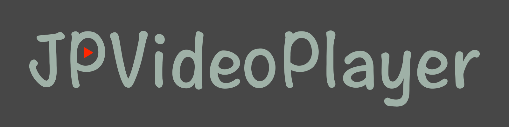
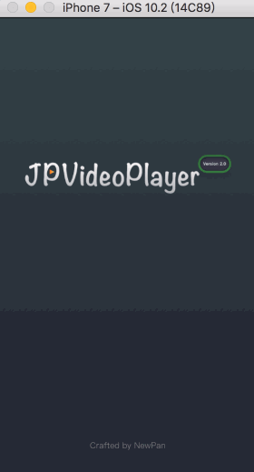

<p align="center" >

</p>

[](https://github.com/Chris-Pan/JPVideoPlayer)
[](https://github.com/Chris-Pan/JPVideoPlayer) 
[](http://www.jianshu.com/users/e2f2d779c022/latest_articles) 
[](https://github.com/apple/swift)
[](https://github.com/Carthage/Carthage)


This library provides an video player with cache support in `UITableView`.

<p align="left" >

</p>

## Watch out
You may download my demo to know how to play video in UITableViewController, this framework just provides a player cache video data at playing.

## Features

- [x] Cache video data at playing
- [x] Handle play or stop video in main thread
- [x] Excellent performance!
- [x] Always play the video of the `UITableViewCell` in screen center when scrolling   
- [x] A guarantee that the same URL won't be downloaded several times
- [x] A guarantee that main thread will never be blocked
- [x] Location video play support
- [x] HTTPS support
- [x] Swift support
- [x] Carthage support
- [x] Landscape support

## Requirements

- iOS 8.0 or later
- Xcode 7.3 or later


## Getting Started

- Read [[iOS]仿微博视频边下边播之封装播放器](http://www.jianshu.com/p/0d4588a7540f)
- Read [[iOS]仿微博视频边下边播之滑动TableView自动播放](http://www.jianshu.com/p/3946317760a6)
- Read [[iOS]从使用 KVO 监听 readonly 属性说起](http://www.jianshu.com/p/abd238407e0d)
- Read [[iOS]如何重新架构 JPVideoPlayer ?](http://www.jianshu.com/p/66638bdfd537)
- Try the example by downloading the project from Github


## Communication

- If you **found a bug**, open an issue.
- If you **have a feature request**, open an issue.
- If you **want to contribute**, submit a pull request.


## Installation

## How To Use

#### Play video, and play audio.
```objective-c
Objective-C:

#import <UIView+WebVideoCache.h>

...
NSURL *url = [NSURL URLWithString:@"http://lavaweb-10015286.video.myqcloud.com/%E5%B0%BD%E6%83%85LAVA.mp4"];
[aview jp_playVideoWithURL:url];
```

```swift
Swift:

import JPVideoPlayer

...
let url = URL(string: videoPath)
aview.jp_playVideoWithURL(with: url)
```

#### Play video muted, display status view.
```objective-c
Objective-C:

#import <UIView+WebVideoCache.h>

...
NSURL *url = [NSURL URLWithString:@"http://lavaweb-10015286.video.myqcloud.com/%E5%B0%BD%E6%83%85LAVA.mp4"];
[aview jp_playVideoHiddenStatusViewWithURL:url];
```

#### Play video muted, hidden status view.
```objective-c
Objective-C:

#import <UIView+WebVideoCache.h>

...
NSURL *url = [NSURL URLWithString:@"http://lavaweb-10015286.video.myqcloud.com/%E5%B0%BD%E6%83%85LAVA.mp4"];
[aview jp_playVideoMutedHiddenStatusViewWithURL:url];
```

#### Play video muted, display status view.
```objective-c
Objective-C:

#import <UIView+WebVideoCache.h>

...
NSURL *url = [NSURL URLWithString:@"http://lavaweb-10015286.video.myqcloud.com/%E5%B0%BD%E6%83%85LAVA.mp4"];
[aview jp_playVideoMutedDisplayStatusViewWithURL:url];
```

#### Custom progress view.
```Objective-C:

#import <UIView+WebVideoCache.h>

...
[aview jp_perfersDownloadProgressViewColor: [UIColor grayColor]];
[aview jp_perfersPlayingProgressViewColor: [UIColor blueColor]];
```

#### Player control.
```Objective-C:

#import <UIView+WebVideoCache.h>

...
[aview jp_stopPlay];
[aview jp_pause];
[aview jp_resume];
[aview jp_setPlayerMute:YES];
```

#### Landscape Or Portrait Control
```Objective-C:

#import <UIView+WebVideoCache.h>

...
[aview jp_perfersLandscapeForViewController:self];
[aview jp_landscapeAnimated:YES completion:nil];
[aview jp_portraitAnimated:YES completion:nil];
```


#### Cache manage.
```Objective-C:

#import <JPVideoPlayerCache.h>

...
[[JPVideoPlayerCache sharedCache] calculateSizeWithCompletionBlock:^(NSUInteger fileCount, NSUInteger totalSize) {
     // do something.
}];

[[JPVideoPlayerCache sharedCache] clearDiskOnCompletion:^{
    // do something
}];
```


Installation
------------

There are three ways to use JPVideoPlayer in your project:
- using CocoaPods
- using Carthage
- by cloning the project into your repository

### Installation with CocoaPods

[CocoaPods](http://cocoapods.org/) is a dependency manager for Objective-C, which automates and simplifies the process of using 3rd-party libraries in your projects. See the [Get Started](http://cocoapods.org/#get_started) section for more details.

#### Podfile
```
platform :ios, '8.0'
target "YourProjectName" do
pod 'JPVideoPlayer', '~> 2.2.3'
end
```

### Installation with Carthage
[Carthage](https://github.com/Carthage/Carthage) is a simple, decentralized dependency manager for Cocoa.

```
github "newyjp/JPVideoPlayer"

```

## Licenses

All source code is licensed under the [MIT License](https://github.com/Chris-Pan/JPVideoPlayer/blob/master/LICENSE).

## Architecture

<p align="left" >

</p>


# 如果你在天朝

## 注意:
如果你需要在UITableViewController中滑动播放视频, 请下载我的完整demo, 这个框架只提供一个边下边缓存视频数据的播放器.

## 特性

- [x] 视频播放边下边播, 同时边缓存到本地
- [x] 主线程处理切换视频
- [x] 不阻塞线程，不卡顿，滑动如丝顺滑
- [x] 当滚屏时采取总是播放处在屏幕中心的那个 cell 的视频的策略
- [x] 保证同一个URL的视频不会重复下载
- [x] 保证不会阻塞线程
- [x] 支持播放本地视频
- [x] HTTPS 支持
- [x] Swift 支持
- [x] Carthage 支持
- [x] 横屏支持

## 组件要求

- iOS 8.0 +
- Xcode 7.3 +


## 如何使用

- 阅读我的简书文章 [[iOS]仿微博视频边下边播之封装播放器](http://www.jianshu.com/p/0d4588a7540f)
- 阅读我的简书文章 [[iOS]仿微博视频边下边播之滑动TableView自动播放](http://www.jianshu.com/p/3946317760a6)
- 阅读我的简书文章 [[iOS]从使用 KVO 监听 readonly 属性说起](http://www.jianshu.com/p/abd238407e0d)
- 阅读我的简书文章 [[iOS]如何重新架构 JPVideoPlayer ?](http://www.jianshu.com/p/66638bdfd537)
- 下载我Github上的demo


## 联系

- 如果你发现了bug, 请帮我提交issue
- 如果你有好的建议, 请帮我提交issue
- 如果你想贡献代码, 请提交请求


## 如何使用

#### 播放音视频.
```objective-c
Objective-C:

#import <UIView+WebVideoCache.h>

...
NSURL *url = [NSURL URLWithString:@"http://lavaweb-10015286.video.myqcloud.com/%E5%B0%BD%E6%83%85LAVA.mp4"];
[aview jp_playVideoWithURL:url];
```

```swift
Swift:

import JPVideoPlayer

...
let url = URL(string: videoPath)
aview.jp_playVideoWithURL(with: url)
```

#### 播放音视频, 隐藏进度指示(可以成为代理添加指示器, 或者直接自定义指示器).
```objective-c
Objective-C:

#import <UIView+WebVideoCache.h>

...
NSURL *url = [NSURL URLWithString:@"http://lavaweb-10015286.video.myqcloud.com/%E5%B0%BD%E6%83%85LAVA.mp4"];
[aview jp_playVideoHiddenStatusViewWithURL:url];
```

#### 静音播放视频, 隐藏进度指示(可以成为代理添加指示器, 或者直接自定义指示器).
```objective-c
Objective-C:

#import <UIView+WebVideoCache.h>

...
NSURL *url = [NSURL URLWithString:@"http://lavaweb-10015286.video.myqcloud.com/%E5%B0%BD%E6%83%85LAVA.mp4"];
[aview jp_playVideoMutedHiddenStatusViewWithURL:url];
```

#### 静音播放视频, 并且显示进度指示.
```objective-c
Objective-C:

#import <UIView+WebVideoCache.h>

...
NSURL *url = [NSURL URLWithString:@"http://lavaweb-10015286.video.myqcloud.com/%E5%B0%BD%E6%83%85LAVA.mp4"];
[aview jp_playVideoMutedDisplayStatusViewWithURL:url];
```

#### 自定义进度指示颜色(下载和播放进度).
```Objective-C:

#import <UIView+WebVideoCache.h>

...
[aview jp_perfersDownloadProgressViewColor: [UIColor grayColor]];
[aview jp_perfersPlayingProgressViewColor: [UIColor blueColor]];
```

#### 播放器控制.
```Objective-C:

#import <UIView+WebVideoCache.h>

...
[aview jp_stopPlay];
[aview jp_pause];
[aview jp_resume];
[aview jp_setPlayerMute:YES];
```

#### 视频横竖屏切换
```Objective-C:

#import <UIView+WebVideoCache.h>

...
[aview jp_perfersLandscapeForViewController:self];
[aview jp_landscapeAnimated:YES completion:nil];
[aview jp_portraitAnimated:YES completion:nil];
```

#### 缓存查询管理.
```Objective-C:

#import <JPVideoPlayerCache.h>

...
[[JPVideoPlayerCache sharedCache] calculateSizeWithCompletionBlock:^(NSUInteger fileCount, NSUInteger totalSize) {
     // do something.
}];

[[JPVideoPlayerCache sharedCache] clearDiskOnCompletion:^{
    // do something
}];
```


## 如何安装

两种选择把框架集成到你的项目:
- 使用 CocoaPods
- 使用 Carthage
- 下载我的demo, 把'JPVideoPlayer'文件夹拽到你的项目中

### 使用 CocoaPods 安装

#### Podfile
```
platform :ios, '8.0'
target "你的项目名称" do
pod 'JPVideoPlayer', '~> 2.2.3'
end
```

### 使用 Carthage 安装

#### cartfile
```
github "newyjp/JPVideoPlayer"
```


## 证书

[MIT License](https://github.com/Chris-Pan/JPVideoPlayer/blob/master/LICENSE)

## 架构

<p align="left" >

</p>
